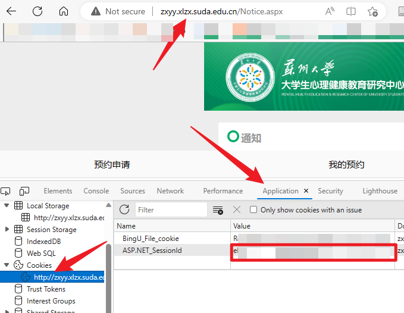
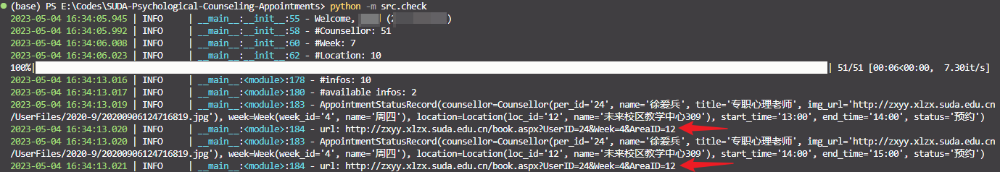

# ❤️‍🩹 苏大心理中心咨询预约查询

查询可预约的心理咨询信息，辅助进行咨询预约。

**声明：**请勿滥用本工具恶意预约！如果你暂时不需要心理咨询，请将宝贵的咨询机会留给更多的人♥️。祝大家心理健康~

## 🌴 安装

1. 准备Python环境（>=3.8），并安装依赖：

```bash
pip install -r requirements.txt
```

2. 下载本仓库代码到本地，并进入代码地址：

```bash
git clone https://github.com/Spico197/SUDA-Psychological-Counseling-Appointments.git
cd https://github.com/Spico197/SUDA-Psychological-Counseling-Appointments.git
```

## 🚀 开始

1. 获取 Cookie：
在浏览器中打开 [http://zxyy.xlzx.suda.edu.cn/](http://zxyy.xlzx.suda.edu.cn/) ，使用统一身份认证登录后，按 `F12` 打开开发者工具，在 `Application -> Cookies` 中找到 `ASP.NET_SessionId` 字段。



2. 将找到的Cookie贴到 `src/check.py` 中的第170行中，例如：`app = App("98j21p98jc1923j")`
3. 修改 `src/check.py` 第172-174行中的检索条件，例如这里的检索条件是不限咨询师和时间，只看地点是否在彩虹楼。如果将这里的“彩虹楼”改为“未来”，则会检索未来校区的可预约情况
4. 运行程序：`python -m src.check`



找到两条可预约记录！点击上面箭头指向的URL则可直接跳转预约界面~

## 🔒 License

Apache 2.0
